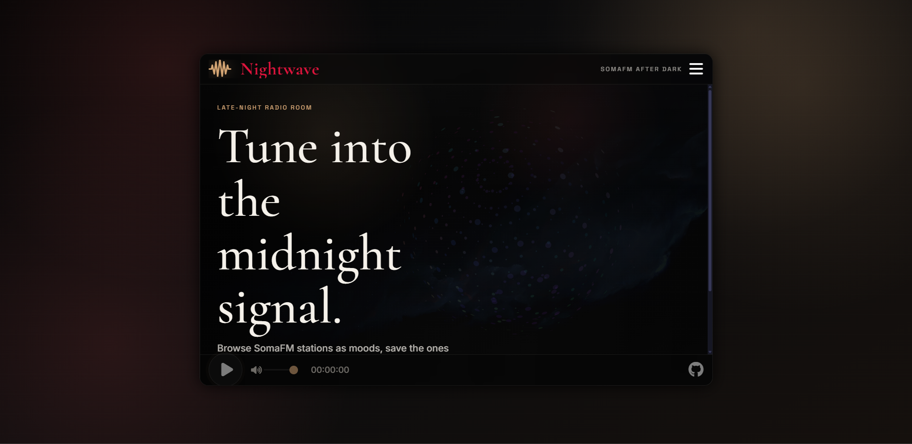
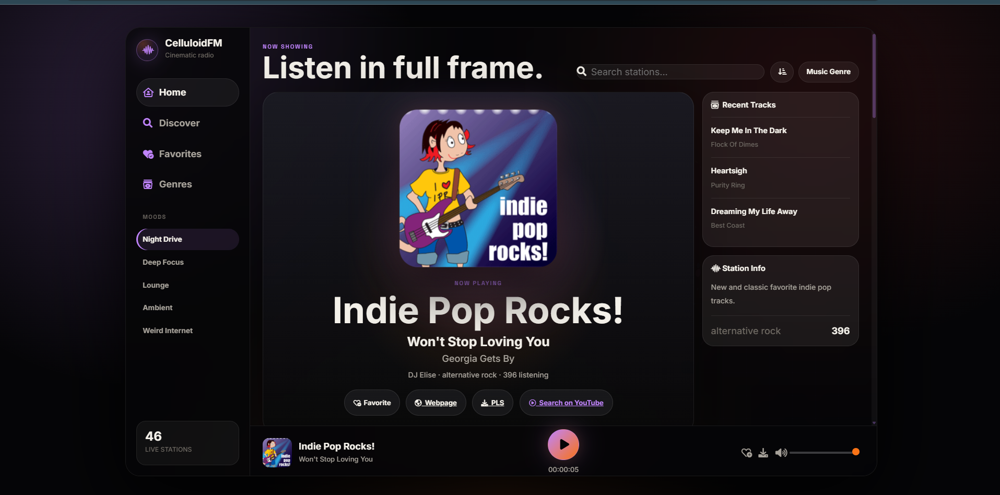

[repo]: https://github.com/easyvansh/celluloidfm
[original]: https://github.com/rainner/soma-fm-player
[somafm]: https://somafm.com/
[audioapi]: https://developer.mozilla.org/en-US/docs/Web/API/AudioContext
[vue]: https://vuejs.org/
[webpack]: https://webpack.js.org/
[three]: https://threejs.org/
[mit]: https://www.opensource.org/licenses/mit-license.php

# CelluloidFM





CelluloidFM is a cinematic SomaFM web radio player redesigned by **Vansh**. It transforms a classic browser radio app into a black, cover-first listening dashboard with Apple Music-style elegance, Linear-like dark panels, Arc-inspired ambient gradients, MUBI/Letterboxd restraint, mood themes, favorites, station search, recent tracks, YouTube discovery, and a Web Audio powered visualizer.


## What It Does

- Streams live radio stations from [SomaFM][somafm].
- Loads station data from `https://somafm.com/channels.json`.
- Lets users search stations and sort by name, listener count, genre, or favorites.
- Plays MP3 streams directly in the browser.
- Shows current and recent track metadata when SomaFM provides it.
- Saves favorite stations in `localStorage`.
- Exports favorites as an `.m3u` playlist.
- Supports station deep links such as `#/channel/groovesalad`.
- Renders a Three.js audio visualizer using browser audio frequency data.
- Adds a cinematic CelluloidFM UI layer with a huge centered station cover, right-side track rail, curated station wall, premium bottom player, ambient theme lighting, and modern typography.
- Includes mood buttons that change the app theme and optionally search matching stations.
- Adds a YouTube search link for the current track when metadata is available.

## Design Direction

CelluloidFM uses a **Cinematic Violet + Projector Amber** identity: black panels, media-first cover art, violet/amber ambient lighting, restrained typography, and curated station cards. The goal is not to clone Spotify. The visual reference is closer to Apple Music's elegance, Linear's dark panels, Arc's ambient gradients, Letterboxd's media identity, and MUBI's restraint.

Core palette:

```scss
$bg: #050507;
$panel: #0d0d11;
$panelSoft: #111116;
$card: #17171d;
$cardHover: #202028;
$text: #f4f1ea;
$muted: #a7a29a;
$accent: #c084fc;   // cinematic violet
$accent2: #f97316;  // projector amber
$accent3: #ef4444;  // soft red
$border: rgba(255, 255, 255, 0.08);
```

Typography:

- UI/body: Inter
- Accent labels: Space Grotesk
- Legacy serif heading font remains loaded, but the current interface uses bold Inter for a sharper product UI.

## UI Highlights

- Huge centered station-art now-playing module.
- Current song, artist, album, station info, listener count, and actions in the hero area.
- YouTube search action for the current track.
- SomaFM page and PLS actions.
- Right rail for recent tracks and station details.
- Curated station wall with one larger featured station card.
- Smaller station cards with hover lift and play affordance.
- Active station glow.
- Persistent premium bottom player with larger play control and volume/favorite/export actions.
- Sidebar navigation with Home, Discover, Favorites, and Genres.
- Mood theme section with Night Drive, Deep Focus, Lounge, Ambient, and Weird Internet.

## Mood Themes

Mood buttons change the app's visual theme, not just station search. The selected mood is applied as a class on `#player-wrap` and saved in `localStorage`.

| Mood | Intent | Theme Direction |
| --- | --- | --- |
| Night Drive | Default cinematic mode | Violet + amber, high contrast |
| Deep Focus | Calm listening | Indigo/blue/violet, lower heat |
| Lounge | Warmer listening | Amber/rose/violet |
| Ambient | Spacious listening | Teal/violet/sky |
| Weird Internet | Stranger stations | Magenta/red/violet |

## Tech Stack

- [Vue 2][vue] loaded from CDN.
- [Three.js][three] loaded from CDN.
- Axios loaded from CDN.
- [Webpack 3][webpack] and Babel for the legacy source build.
- Sass source styles in `src/scss/`.
- `public/css/nightwave.css` as the currently loaded visible CelluloidFM override.
- Static hosting friendly: no backend is required.

## Project Structure

```text
.
|-- index.html              # App shell and Vue template
|-- README.md               # Project documentation
|-- CNAME                   # Custom domain config, if used
|-- `package.json            # Legacy npm scripts and dependencies
|-- webpack.config.js       # Legacy Webpack 3 build config
|-- public/
|   |-- bundles/            # Existing compiled JS/CSS bundle
|   |-- css/
|   |   |-- fonts.css
|   |   `-- nightwave.css   # Current visible CelluloidFM theme override
|   |-- fonts/              # Local font and icon assets
|   |-- img/                # Background images
|   `-- audio/              # Small audio assets
`-- src/
    |-- app.js              # Vue state, routing, controls, favorites, UI actions
    |-- js/
    |   |-- audio.js        # HTML audio and Web Audio API logic
    |   |-- soma.js         # SomaFM API fetch and channel normalization
    |   |-- scene.js        # Three.js visualizer scene
    |   |-- sphere.js       # Visualizer object
    |   |-- store.js        # localStorage helper
    |   |-- favorite.js     # Favorite button component
    |   |-- filters.js      # Vue filters
    |   `-- utils.js        # Search and sort helpers
    `-- scss/               # Source Sass theme files
````

## Run Locally

The fastest way to run the current app is with a static server:

```bash
python -m http.server 8000
```

Open:

```text
http://localhost:8000
```

This works because the app is already static and loads the current CelluloidFM CSS override directly from `public/css/nightwave.css`.

## Deploy To Vercel

CelluloidFM should be deployed to Vercel as a static site. The repo includes `vercel.json` so Vercel skips dependency installation and avoids the legacy `node-sass@4` build failure.

Use these Vercel project settings:

```text
Framework Preset: Other
Install Command: echo "Skipping dependency install for static deployment"
Build Command: echo "No build required for CelluloidFM static deployment"
Output Directory: .
```

Deployment steps:

1. Commit and push the latest files, including `vercel.json`.
2. Import `github.com/easyvansh/celluloidfm` in Vercel.
3. Keep the framework preset as `Other`.
4. Confirm the commands above are set in Project Settings.
5. Deploy.

Do not run `npm run build` on Vercel until the legacy build stack is modernized.

## Legacy Build Commands

Install dependencies:

```bash
npm install
```

Run the Webpack dev server:

```bash
npm run dev
```

Build production bundles:

```bash
npm run build
```

## Compatibility Note

This project still contains a legacy build stack: Webpack 3, Vue 2, and `node-sass@4`. On modern Node.js versions, `npm install` may fail because `node-sass@4` depends on old native build tooling.

For now, the practical workflow is:

1. Run the app with `python -m http.server 8000`.
2. Edit `index.html` and `public/css/nightwave.css` for visible UI changes.
3. Treat `src/scss/` as the source direction for a future build-tool upgrade.

A future modernization pass should replace `node-sass` with `sass`, update Webpack or migrate to Vite, and then remove the need for a standalone CSS override.

## Key Files To Update

| Goal | File |
| --- | --- |
| App structure and Vue template | `index.html` |
| Current visible CelluloidFM styling | `public/css/nightwave.css` |
| Source theme tokens and Sass styles | `src/scss/` |
| Player state, favorites, routing, and controls | `src/app.js` |
| SomaFM API handling | `src/js/soma.js` |
| Audio playback engine | `src/js/audio.js` |
| Visualizer scene | `src/js/scene.js`, `src/js/sphere.js` |
| Custom domain | `CNAME` |

## Update Checklist

Before pushing changes, test these flows:

- Station list loads.
- Search works.
- Sorting works.
- Selecting a station updates the URL hash.
- Playback starts after a user click.
- Volume control works.
- Favorites can be toggled.
- Favorites can be exported.
- Mood buttons change the visual theme.
- Recent tracks load.
- YouTube search link appears for current track metadata.
- The visualizer appears during playback.
- Mobile layout remains usable.

## Git Workflow

Stage and commit your changes:

```bash
git add .
git commit -m "Update CelluloidFM cinematic UI"
```

Push to your GitHub repository:

```bash
git push -u origin main
```

If the remote is not set correctly:

```bash
git remote set-url origin https://github.com/easyvansh/celluloidfm.git
```

## Credits

- Maintainer and redesign: **Vansh**


## License

This project keeps the original MIT license. See [MIT License][mit].
